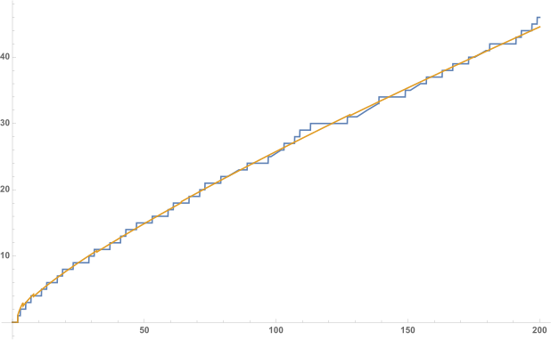

# Explicit formula

According to the definition, Riemann xi function is defined as

$$
\xi(s)=(s-1)\pi^{-s/2}\Gamma\left(\frac s2+1\right)\zeta(s)\tag1
$$

By Hadamard's factorization theorem, the xi function also has a product representation based on its zeros:

$$
\xi(s)=\xi(0)\prod_{\xi(\rho)=0}\left(1-\frac s\rho\right)\tag2
$$

## A formula for the logarithmic derivative of $\zeta(s)$

Juxtaposing (1) and (2) gives us

$$
\log\xi(0)+\sum_\rho\log\left(1-\frac s\rho\right)=\log(s-1)-\frac s2\log\pi+\log\Gamma\left(\frac s2+1\right)+\log\zeta(s)
$$

Now, differentiate on both side and manipulate the result algebraically, so we have

$$
-{\zeta'\over\zeta}(s)={1\over s-1}-\frac12\log\pi+\frac12{\Gamma'\over\Gamma}\left(\frac s2+1\right)-\sum_\rho{1\over s-\rho}
$$

To avoid convergence issue, we add $\zeta'/\zeta(0)$ to both side to get

$$
{\zeta'\over\zeta}(0)-{\zeta'\over\zeta}(s)={1\over s-1}+1+\frac12{\Gamma'\over\Gamma}\left(\frac s2+1\right)-\frac12{\Gamma'\over\Gamma}(1)-\sum_\rho\left[{1\over s-\rho}+\frac1\rho\right]\tag3
$$

Using the product representation of Gamma function, it easily follows

$$
\log\Gamma\left(\frac s2+1\right)=-\frac s2\gamma+\sum_{k=1}^\infty\left[{s\over2k}-\log\left(1+{s\over2k}\right)\right]
$$

which indicates

$$
\frac12{\Gamma'\over\Gamma}\left(\frac s2+1\right)=-\frac\gamma2+\sum_{k=1}^\infty\left[{1\over2k}-{1\over s+2k}\right]\tag4
$$

Plugging this result back to (3) gives

$$
-{\zeta'\over\zeta}(s)={s\over s-1}+\sum_{k=1}^\infty\left[{1\over2k}-{1\over s+2k}\right]-\sum_\rho\left[{1\over s-\rho}+\frac1\rho\right]-{\zeta'\over\zeta}(0)
$$

## A subtle integral

In this section, we want to evaluate the following expression

$$
m(x)={1\over2\pi i}\int_{c-i\infty}^{c+i\infty}{x^s\over s}\mathrm ds
=\lim_{T\to\infty}{1\over2\pi i}\int_{c-iT}^{c+iT}{x^s\over s}\mathrm ds
$$

By Cauchy's integral theorem, when $0\le x<1$, the value of $m(x)$ does not change even if we let $s$ run through $c+Te^{i\theta}$ with $\theta$ ranging from $-\pi/2$ to $\pi/2$. Accordingly, we obtain

$$
\begin{aligned}
|m(x)|
&=\left|{1\over2\pi}\int_{-\pi/2}^{\pi/2}{x^{c+Te^{i\theta}}\over c+Te^{i\theta}}\cdot Te^{i\theta}\mathrm d\theta\right| \\
&\le{Tx^c\over2\pi}\int_{-\pi/2}^{\pi/2}{x^{T\cos\theta}\over T-c}\mathrm d\theta={Tx^cx^{T\cos\alpha}\over2(T-c)}
\end{aligned}
$$

wherein $\alpha\in(-\pi/2,\pi/2)$, meaning $\cos\alpha>0$. Accordingly, if we take $T\to\infty$ then can get $m(x)=0$ whenever $0\le x<1$.

For $x=1$, this integral can be handled without contour integration:

$$
\begin{aligned}
{1\over2\pi i}\underbrace{\int_{c-iT}^{c+iT}{\mathrm ds\over s}}_{s=c+i\omega}
&={1\over2\pi}\int_{-T}^T{\mathrm d\omega\over c+i\omega} \\
&={1\over2\pi}\int_{-T}^T{c-i\omega\over c^2+\omega^2}\mathrm d\omega \\
&={1\over2\pi}\int_{-T}^T{c\over c^2+\omega^2}\mathrm d\omega \\
&=\frac1\pi\arctan\left(\frac Tc\right)\to\frac12
\end{aligned}
$$

In other words, this means $m(1)=1/2$.

Now, for $x>1$, we can integrate over the left semi circle. That is, the contour consists of two parts:

- $\Sigma$: A vertical segment running from $c-iT$ to $c+iT$
- $\Gamma$: An arc: if $s=c+Te^{i\theta}$ then $\theta$ runs from $\pi/2$ to $3\pi/2$

which gives us the following identity:

$$
{1\over2\pi i}\oint_{\Sigma+\Gamma}{x^s\over s}\mathrm ds={1\over2\pi i}\int_{c-iT}^{c+iT}{x^s\over s}\mathrm ds+{1\over2\pi i}\int_\Gamma{x^s\over s}\mathrm ds\tag5
$$

wherein the left hand side evaluates to

$$
{1\over2\pi i}\oint_{\Sigma+\Gamma}{x^s\over s}\mathrm ds=x^0=1
$$

since the integrand has a pole at the origin, and the integral over the arc tends to zero as $T\to\infty$:

$$
\begin{aligned}
\left|{1\over2\pi i}\int_\Gamma{x^s\over s}\mathrm ds\right|
&\le{x^c\over2\pi}\int_{\pi/2}^{3\pi/2}{Tx^{T\cos\theta}\over T-c}\mathrm d\theta \\
&={x^c\over2}{Tx^{T\cos\eta}\over T-c}\to0
\end{aligned}
$$

Plug these results into (5), we conclude for $x>1$, $m(x)$ evalutes to zero. Therefore, combining every situation, we have

$$
{1\over2\pi i}\int_{c-i\infty}^{c+i\infty}{x^s\over s}\mathrm ds=
\begin{cases}
0 & 0\le x<1 \\
\frac12 & x=1 \\
1 & x>1
\end{cases}
$$

In addition, it can be easily deduced that for $x>1$ there is

$$
{1\over2\pi i}\int_{c-i\infty}^{c+i\infty}{x^s\over s(s-z)}\mathrm ds={x^z\over z}-\frac1z
$$

## Perron's formula

There are many ways to derive Perron's formula, but it is possible to verify it without knowledge of integral transform. Now, let $a(n)$ be some arithmetic function and $D(s)$ be its corresponding Dirichlet series, so that

$$
\begin{aligned}
{1\over2\pi i}\int_{c-i\infty}^{c+i\infty}D(s){x^s\over s}\mathrm ds
&=\sum_{n<x}a(n){1\over2\pi i}\int_{c-i\infty}^{c+i\infty}{(x/n)^s\over s}\mathrm ds+[x\in\mathbb N^*]\frac12a(x)
\end{aligned}
$$

On top of this, define $A(x)$ as $a(n)$'s summatory function, then the integral can be understood as its Cauchy principal value:

$$
\frac12[A(x^-)+A(x^+)]={1\over2\pi i}\int_{c-i\infty}^{c+i\infty}D(s){x^s\over s}\mathrm ds
$$

and this is known as Perron's formula, which converts a Dirichlet series into partial sum. One corollary follows directly from this identity:

$$
\frac12\left[\sum_{n<x}{a(n)\over n^r}+\sum_{n\le x}{a(n)\over n^r}\right]={1\over2\pi i}\int_{c-i\infty}^{c+i\infty}\sum_{k=1}^\infty{a(k)\over k^{s+r}}{x^s\over s}\mathrm ds
$$

### von Mangoldt's explicit formula

It is known that

$$\sum_{d|n}\Lambda(d)=\log n$$

and

$$
\sum_{n=1}^\infty{\log n\over n^s}=-\zeta'(s)
$$

Hence, by Mobius inversion, we get

$$
\sum_{n=1}^\infty{\Lambda(n)\over n^s}=-{\zeta'\over\zeta}(s)
$$

which for noninteger $x$, by Perron's formula we have

$$
\sum_{n\le x}{\Lambda(n)\over n^r}={1\over2\pi i}\int_{c-i\infty}^{c+i\infty}\left[-{\zeta'\over\zeta}(s+r)\right]{x^s\over s}\mathrm ds\tag6
$$

Similar with techniques used to derive (4), we have

$$
-{\zeta'\over\zeta}(s+r)={1\over s+r-1}-{1\over r-1}-\sum_{k=1}^\infty\left[{1\over s+r+2k}-{1\over r+2k}\right]-\sum_\rho\left[{1\over s+r-\rho}-{1\over r-\rho}\right]-{\zeta'\over\zeta}(r)
$$

Plugging this back into (6), we get

$$
\sum_{n\le x}{\Lambda(n)\over n^r}={x^{1-r}\over1-r}+\sum_{k=1}^\infty{x^{-2k-r}\over2k+r}-\sum_\rho{x^{\rho-r}\over\rho-r}-{\zeta'\over\zeta}(r)\tag7
$$

Setting $r=0$, we obtain the explicit formula for Chebyshev's psi function:

$$
\begin{aligned}
\psi(x)
&=x+\frac12\sum_{k=1}^\infty{x^{-2k}\over k}-\sum_\rho{x^\rho\over\rho}-{\zeta'\over\zeta}(0) \\
&=x-{\zeta'\over\zeta}(0)-\sum_\rho{x^\rho\over\rho}-\frac12\log(1-x^{-2})
\end{aligned}
$$

## Riemann's prime counting function and its explicit formula

As the original paper suggests, Riemann used analytic methods to study the following function:

$$
\Pi_0(x)\triangleq\sum_{p^k\le x}\frac1k\tag8
$$

Interchanging the summation symbol yields a relationship between $J(x)$ and the standard prime counting function $\pi(x)$:

$$
\Pi_0(x)=\sum_{k\le\log_2x}\frac1k\sum_{p\le x^{1/k}}1=\sum_{k=1}^\infty{\pi(x^{1/k})\over k}
$$

It is also possible to invert this relationship via Mobius inversion formula:

$$
\pi(x)=\sum_{n=1}^\infty{\mu(n)\Pi_0(x^{1/n})\over n}
$$

If we pay more attention to (8), we can discover that this function can be rewritten using von Mangoldt's $\Lambda(n)$:

$$
\Pi_0(x)=\sum_{2\le n\le x}{\Lambda(n)\over\log n}=\int_0^x{\mathrm d\psi(t)\over\log t}
$$

Due to the Laplace transform identity that

$$
\int_0^\infty e^{-r\eta}\mathrm dr=\frac1\eta
$$

we deduce a representaton of $\Pi_0(x)$ using double integrals:

$$
\Pi_0(x)=\int_0^\infty\int_0^x t^{-r}\mathrm d\psi(t)\mathrm dr
$$

By the definition of Riemann-Stieljtes integral, we discover that the inner section of this double integral is exactly (7), meaning

$$
\Pi_0(x)=\int_0^\infty{x^{1-r}\over1-r}\mathrm dr+\sum_{k=1}^\infty\int_0^\infty{x^{-2k-r}\over2k+r}\mathrm dr-\sum_\rho\int_0^\infty{x^{\rho-r}\over\rho-r}\mathrm dr-\int_0^\infty{\zeta'\over\zeta}(r)\mathrm dr
$$

and all these integrals are interpreted in the sense of Cauchy principal value:

$$
\begin{aligned}
\sum_{k=1}^\infty\int_0^\infty{x^{-2k-r}\over2k+r}\mathrm dr
&=\int_0^\infty\int_x^\infty\sum_{k=1}^\infty t^{-2k-r-1}\mathrm dt\mathrm dr \\
&=\int_x^\infty{t^{-3}\over1-t^{-2}}\int_0^\infty t^{-r}\mathrm dr\mathrm dt \\
&=\int_x^\infty{\mathrm dt\over t(t^2-1)\log t}
\end{aligned}
$$

Let $\rho=\alpha+i\beta$, then

$$
\begin{aligned}
I(\rho)
&=\int_0^\infty{x^{\rho-r}\over\rho-r}\mathrm dr \\
&=\int_0^\infty{e^{(\rho-r)\log x}\log x\over(\rho-r)\log x}\mathrm dx \\
&=\int_{\rho\log x-\infty}^{\rho\log x}{e^t\over t}\mathrm dt \\
&=\int_{-\infty}^{\rho\log x}{e^t\over t}\mathrm dt-\int_{-\infty}^{\rho\log x-\infty}
\end{aligned}
$$

in which the last integral evaluates to zero. Since there is a singularity in the origin, we let the path of integration go through the complex domain:

$$
\begin{aligned}
I(\rho)
&=\lim_{\delta\to0}\left[\underbrace{\int_{-\infty}^{-\delta}+\int_\delta^{\log(x^\rho)}{e^t\over t}\mathrm dt}_{u=e^t}-\operatorname{sgn}(\Im\rho)i\pi\right] \\
&=\lim_{\delta\to0}\left[\int_0^{e^{-\delta}}+\int_{e^\delta}^{x^\rho}{\mathrm du\over\log u}\right]-\operatorname{sgn}(\Im\rho)i\pi \\
&=\lim_{\varepsilon\to0}\left[\int_0^{1-\varepsilon}+\int_{1+\varepsilon}^{x^\rho}{\mathrm du\over\log u}\right]-\operatorname{sgn}(\Im\rho)i\pi \\
&=\int_0^{x^\rho}{\mathrm du\over\log u}\triangleq\operatorname{li}(x^\rho)-\operatorname{sgn}(\Im\rho)i\pi
\end{aligned}
$$

For the remaining part, we have

$$
\begin{aligned}
\int_0^\infty{\zeta'\over\zeta}(r)\mathrm dr
&=\lim_{\delta\to0}\left[\int_0^{1-\delta}+\int_{1+\delta}^\infty{\zeta'\over\zeta}(r)\mathrm dr\right] \\
&=\lim_{\delta\to0}\log{\zeta(1-\delta)\over\zeta(1+\delta)}-\log\zeta(0) \\
&=-\log2+i\pi
\end{aligned}
$$

Eventually, if we were to combine everything, we deduce Riemann's main formula

$$
\Pi_0(x)=\operatorname{li}(x)-\log2-\sum_\rho\operatorname{li}(x^\rho)+\int_x^\infty{\mathrm dt\over t(t^2-1)\log t}
$$

Due to the prime-number theorem, we see $\Pi_0(x)\sim\operatorname{li}(x)$, so we are able to derive an asymptotic expansion for $\pi(x)$:

$$
\pi(x)\sim\sum_{1\le n\le\log_2x}{\mu(n)\operatorname{li}(x^{1/n})\over n}=\operatorname{li}(x)-\frac12\operatorname{li}(x^{1/2})-\frac13\operatorname{li}(x^{1/3})-\frac15\operatorname{li}(x^{1/5})+\frac16\operatorname{li}(x^{1/6})-\frac17\operatorname{li}(x^{1/7})+\dots
$$

Placing these equations into Wolfram Mathematica, we discover that the asymptotic expansion virtually yields a very close approximation:

